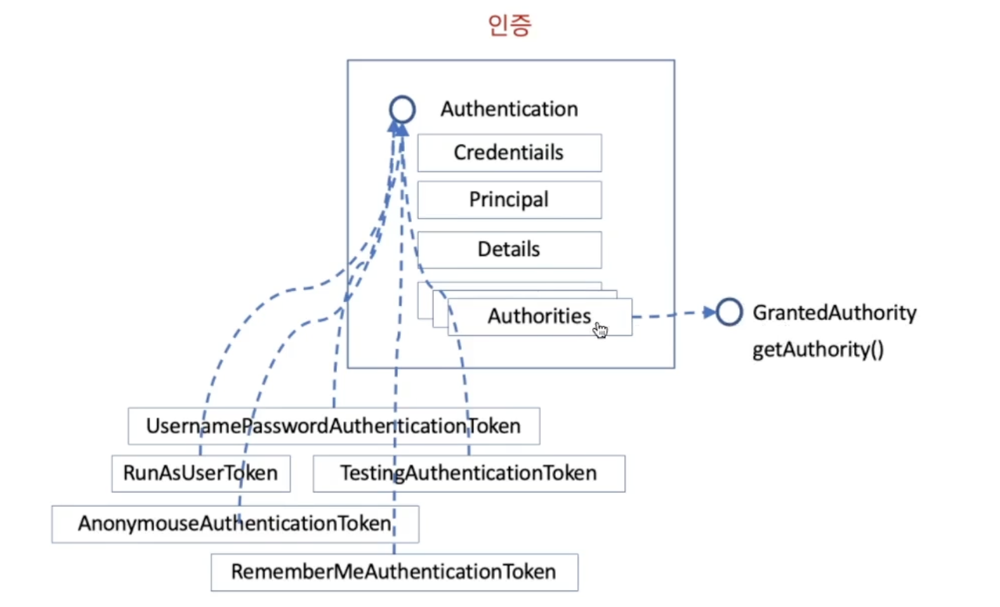

# 인증 (Authentication)

- ## Authentication 은 인증된 결과만 저장하는 것이 아니고, 인증을 하기 위한 정보와 인증을 받기 위한 정보가 동시에 들어 있다.
    - ### **Credentials** : 인증을 받기 위해 필요한 정보, 비번등 (input)
    - ### **Principal** : 인증된 결과, 인증 대상 (output)
    - ### **Details** : 기타 정보, 인증에 관여된 주변 정보들
    - ### **Authorities** : 권한 정보들

- ## Authentication 을 구현한 객체들은 일반적으로 Token 이라는 이름의 객체로 구현한다.
- ## Authentication 객체는 SecurityContextHolder 를 통해 세션이 있건 없건 언제든 접근할 수 있도록 필터체인에서 보장해 준다.

