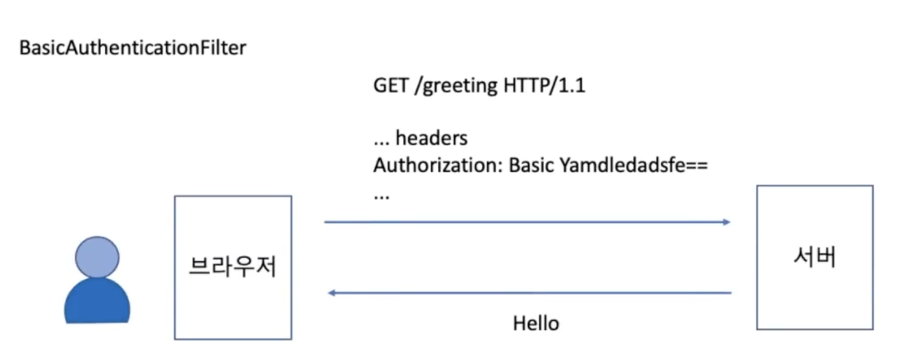

# BasicAuthenticationFilter 

- ### 기본적으로 로그인 페이지(서버에서 제공하는 로그인 페이지) 를 사용할 수 없는 상황에서 사용한다.
    - SPA 페이지 (React, Angular, Vue ...)
    - 브라우저 기반의 모바일 앱(브라우저 기반의 앱, ex: ionic)

## 설정 방법

```java
public class SecurityConfig extends WebSecurityConfigurerAdapter {

    @Override
    protected void configure(HttpSecurity http) throws Exception {
        http
                .httpBasic()
                ;
    }
}
```

- ### SecurityContext 에 인증된 토큰이 없다면 아래와 같은 포멧의 토큰을 받아서 인증처리를 하고 간다.



- ### http 에서는 header 에 username:password 값이 묻어서 가기 때문에 보안에 매우 취약하다. 그래서 반드시 https 프로토콜에서 사용할 것을 권장하고 있다.

- ### 최초 로그인시에만 인증을 처리하고, 이후에는 session에 의존한다. 또 RememberMe 를 설정한 경우, remember-me 쿠키가 브라우저에 저장되기 때문에 세션이 만료된 이후라도 브라우저 기반의 앱에서는 장시간 서비스를 로그인 페이지를 거치지 않고 이용할 수 있다.

- ### 에러가 나면 401 (UnAuthorised : 허가받지 않은) 에러를 내려보낸다.

- ## 로그인 페이지 처리는 주로 아래와 같은 방식으로 한다.