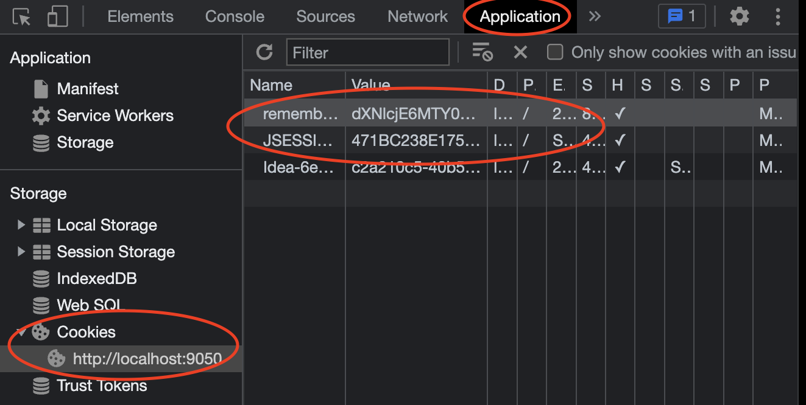
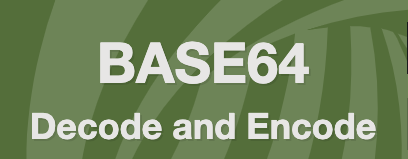

# remember-me
    Remember Me 기능은 사용자 세션이 만료되고 웹 브라우저가 종료된 후에도 애플리케이션이 사용자의 정보를 기억하는 기능이다.
    사용자가 로그인을 할 때 Remember me기능을 활성화 시킬 경우 서버에서는 Remember Me 쿠키를 생성하게 된다. 그 후 로그인을 할 때는 애플리케이션에 저장되어 있는 Remember Me쿠키를 갖고 http header에 쿠키를 담아서 request를 보내게 되며 server는 http header를 확인한 후 토큰 기반의 인증을 통해 유효성 검사를 하고 로그인 승인을 해준다.

## 개발자 도구에서 일반 토큰과 remember-me 토큰 보기

### **remember-me 토큰** : dXNlcjE6...   

### **디코드** : user1:1647440775465:f02a2705dc561b9b55be066dfff61be5

|아이디|만료시간|서명값|
|-|-|-|
|user1|1647440775465|f02a2705dc561b9b55be066dfff61be5|

위 사이트에서 확인가능하다.
