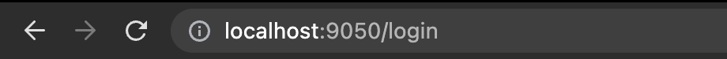
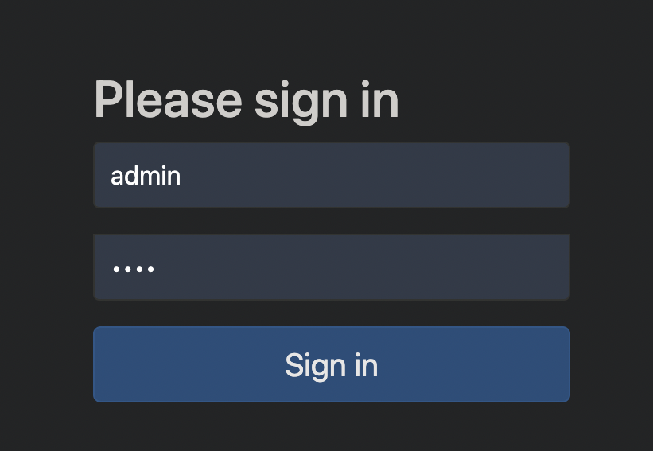
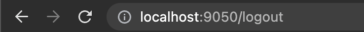

# DefaultLoginPageGeneratingFilter (Spring Security )

* ##  GET /login 을 처리한다.
* ## 별도의 로그인 페이지를 설정하지 않으면 제공된다.

     
     
* ## 기본 로그인 폼을 지원한다.
* ## OAuth2 / OpenID / Saml2 로그인과도 같이 사용할 수 있다.

 

# DefaultLogoutPageGeneratingFilter

* ## GET /logout 을 처리한다.
* ## POST /logout 을 요청할 수 있는 UI 를 제공한다.

     
    
* ## csrf 토큰 처리된다.

